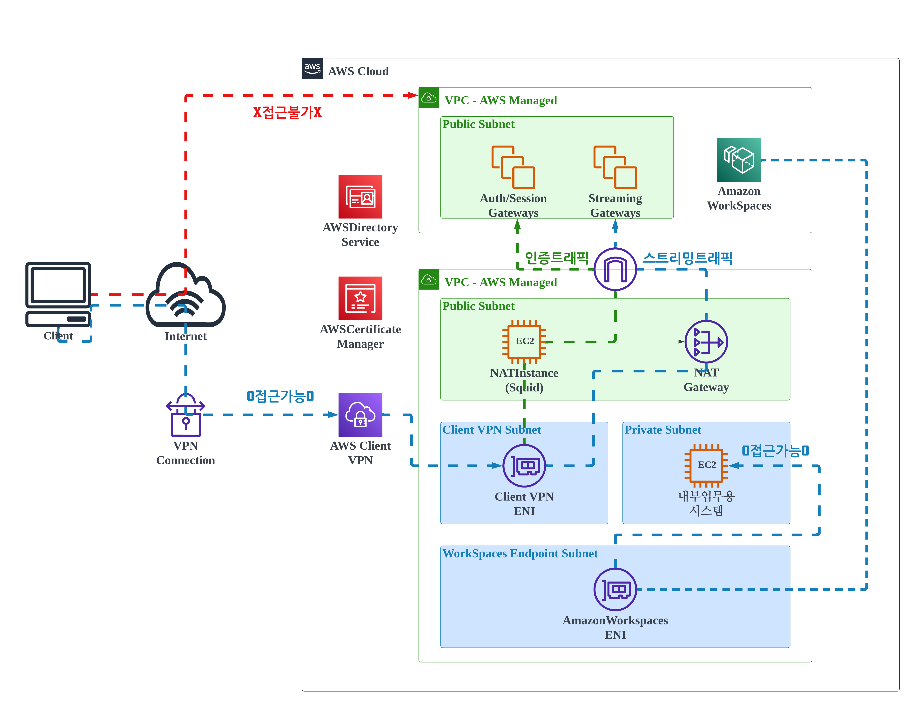

# 안전한 원격 근무 환경 구축 가이드

이 가이드는 AWS (Amazon Web Services)를 사용하여 안전한 원격 근무 환경을 구축하는 단계를 안내합니다. 이 환경은 AWS Client VPN 및 AWS WorkSpaces를 기반으로 합니다.

## 스텝 1: AWS 콘솔에 로그인하고 리전 선택

1. AWS 콘솔에 로그인하고 Seoul 리전을 선택합니다.

## 스텝 2: EC2 대시보드에서 Key Pair 생성

2. EC2 대시보드로 이동하고 키페어 (Key Pair)를 생성합니다. 이 키페어는 나중에 VPN 및 WorkSpaces에 사용됩니다.

## 스텝 3: CloudFormation을 사용하여 스택 1 생성

3. CloudFormation 탭으로 이동하고 `grw-resource_1.yaml` 파일을 사용하여 스택 1을 생성합니다. 스택 생성 시 생성한 키페어를 파라미터로 선택합니다. 스택 생성에 약 5분이 소요됩니다.

## 스텝 4: 스택 1이 생성되면 리소스 확인

- VPC: grw-vpc (Cidr: 10.0.0.0/16)
- Subnets:
  - grw-pub-sb-az-a: 10.0.1.0/24
  - grw-pub-sb-az-c: 10.0.2.0/24
  - grw-pri-sb-az-a: 10.0.3.0/24
  - grw-pri-sb-az-c: 10.0.4.0/24
  - grw-vpn-sb-az-a: 10.0.100.0/24
  - grw-vpn-sb-az-c: 10.0.101.0/24
  - grw-workspaces-sb-az-a: 10.0.200.0/24
  - grw-workspaces-sb-az-c: 10.0.201.0/24
- Routing Tables:
  - grw-pub-rt: 0.0.0.0/0 -> grw-igw
  - grw-pri-rt: 0.0.0.0/0 -> NAT Instance
  - grw-vpn-rt: 0.0.0.0/0 -> NAT Instance, WorkSpaces에서 사용하는 IP들 -> NAT Gateway
  - grw-workspaces-rt: 0.0.0.0/0 -> NAT Instance
- Security Groups:
  - grw-inner-system-sg: 인바운드 허용 - http, https 0.0.0.0/0, ssh 10.0.1.100 / 아웃바운드 모든
  - grw-nat-sg: 인바운드 허용 - ssh, http, https 0.0.0.0/0, icmp 10.0.0.0/16 / 아웃바운드 모든
  - grw-vpn-sg: 인바운드 허용 - http, https 0.0.0.0/0 / 아웃바운드 모든
- EC2 Instances:
  - grw-nat-instance: 10.0.1.100 - NAT 및 Squid 설정 완료
  - grw-inner-system: 10.0.3.100 - 웹 서버 설정 완료

## 스텝 5: Certificate Manager에서 Server 인증서 생성

5. Certificate Manager에서 서버 인증서를 생성합니다.

## 스텝 6: CloudFormation을 사용하여 스택 2 생성

6. CloudFormation 탭에서 `grw-resource_2.yaml` 파일을 사용하여 스택 2를 생성합니다. 스택 생성 시 서버 인증서를 사용합니다.

## 스텝 7: CloudFormation을 사용하여 스택 3 생성

7. CloudFormation 탭에서 `grw-resource_3.yaml` 파일을 사용하여 스택 3을 생성합니다.

## 스텝 8: Client VPN 접속 프로그램 다운로드 및 연결 테스트

8. Client VPN 접속 프로그램을 다운로드하고 연결을 테스트합니다.

## 스텝 9: WorkSpaces 생성 및 아이피 엑세스 그룹 설정

9. WorkSpaces 탭에서 WorkSpace를 생성하고, 아이피 엑세스 그룹을 설정하여 NAT Instance 및 NAT Gateway IP만 접근 가능하도록 합니다.

## 스텝 10: 보안 그룹 설정

10. `grw-inner-system-sg` 보안 그룹에서 http 및 https를 10.0.200.0/23 범위의 IP로 인바운드 규칙을 수정합니다.

---

리소스 삭제는 반대로 진행합니다.

더 자세한 정보와 스크린샷은 [AWS 공식 문서](https://docs.aws.amazon.com/)에서 확인할 수 있습니다.